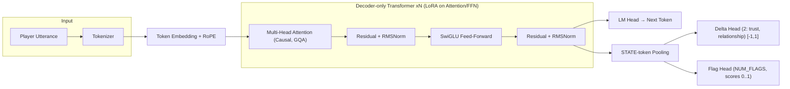
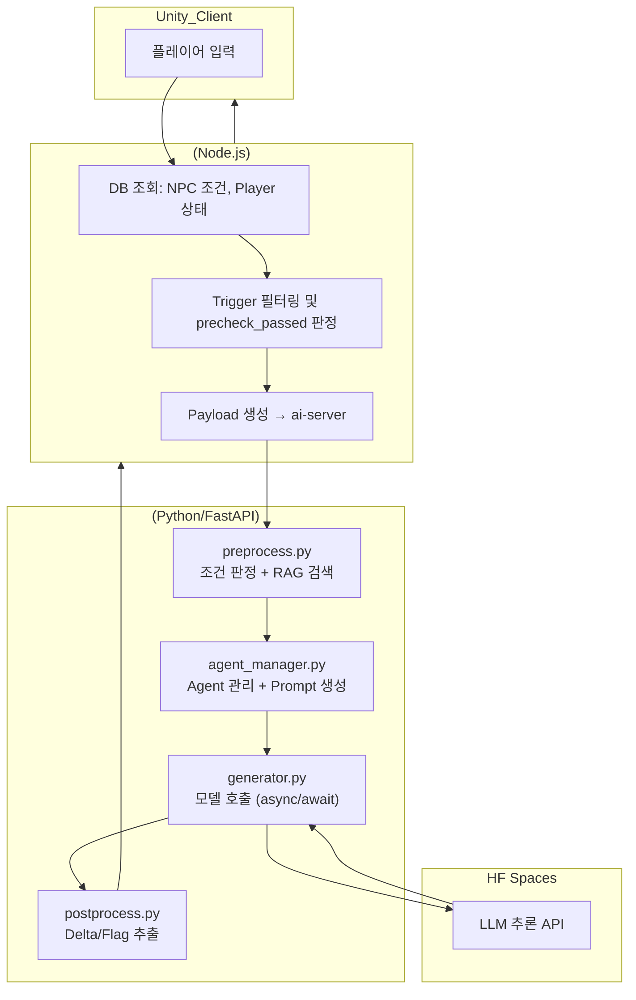
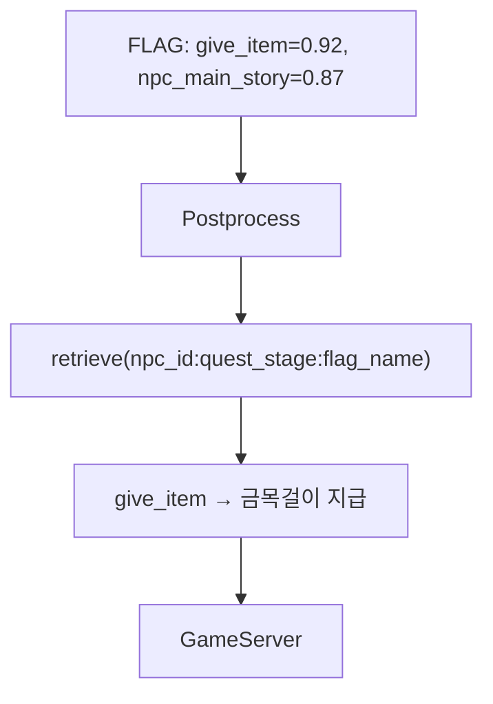

# Persona Chat Engine – AI NPC Dialogue System 🎭

[](https://github.com/m97j/persona-chat-engine)


## 📑 목차
- [📌 개요](#-개요)
- [🧭 아키텍처](#-아키텍처)
- [⚙️ AI 서버 (ai-server/)](#%EF%B8%8F-ai-서버-ai_server)
- [🚀 Hugging Face Serve (hf-serve/)](#-hugging-face-spaces-hf-serve)
- [📊 모델 학습 (train/)](#-모델-학습-train)
- [📦 배포 계획](#-배포-계획)
- [🎥 시연 자료](#-시연-자료)
- [🏁 프로젝트 성과](#-프로젝트-성과)

---

## 📌 개요
**Persona Chat Engine**은 게임 내 NPC(Non-Player Character)와의 상호작용을 위한 AI 대화 엔진입니다.  
플레이어의 선택/행동, NPC 상태를 반영해 자연스러운 대사와 퀘스트 진행을 생성하며, **Delta/Flag** 기반의 상태 변화(신뢰·관계)와 이벤트 트리거를 함께 예측합니다.

- **목표:** 게임 환경에서 몰입감 있는 AI NPC 대화와 퀘스트 반응 생성
- **핵심 기술:** Transformer 기반 LLM, QLoRA 파인튜닝, 멀티헤드 학습(Delta/Flag), 커스텀 프롬프트 포맷, RAG 기반 flag 해석

---

## 🧭 아키텍처

* ### 모델 아키텍처


* ### 전체 프로젝트 통신 구조
  ver 1

  ver2


* ### 전체 프로젝트 구조

```mermaid
---
config:
  theme: dark
---
flowchart RL
 subgraph Client["Game Client (Unity)"]
        CLIENT_IN["session_id, npc_id, user_input"]
  end
 subgraph Payload["payload 구조"]
        ssid["session_id"]
        npcid["npc_id"]
        ctx["context"]
        history["dialogue_history"]
  end
 subgraph GameServer["Game Server (Node.js)"]
        BUILD_PAYLOAD["payload 구성"]
        Payload
        APPLY["ai-server결과 적용"]
        UPDATE_DB["상태/DB 업데이트"]
        CLIENT["클라이언트 전송\n(아이템ID, 퀘스트 단계 등)"]
  end
 subgraph app["app.py"]
        ask["/ask endpoint"]
  end
 subgraph PRE["Preprocess"]
        VALIDATE["입력 유효성 체크"]
        FILTER["금지어/조건 필터링"]
  end
 subgraph POST["Postprocess"]
        MAP["flag index→name 매핑"]
        RAG_MATCH["RAG 기반 flag 설명/조건 확인"]
        FORMAT["게임서버 전송 포맷 변환"]
  end
 subgraph dlgmang["dialogue_manager.py"]
        PRE
        POST
        DECISION{"전처리 통과?"}
  end
 subgraph mainprpt["build main prompt"]
        mSYS[": NPC 메타, tags, lore, player_state"]
        mRAG[": 추론시 조건/지시문 (학습시 비움)"]
        mCTX[": 대화 이력"]
        mPLAYER[": 플레이어 발화"]
  end
 subgraph fbprpt["build fallback prompt"]
        fSYS[": NPC 메타, tags, lore, player_state"]
        fRAG[": 추론시 조건/지시문 (학습시 비움)"]
        fPLAYER[": 플레이어 발화"]
  end
 subgraph PROMPTBUILD["prompt_builder.py"]
        mainprpt
        fbprpt
  end
 subgraph FB["Fallback Model (경량)"]
        FB_GEN["간단 응답 생성"]
  end
 subgraph raggen["rag_generator.py"]
        RAG_GEN["retrieve"]
  end
 subgraph AIServer["ai_server (Python)"]
        app
        dlgmang
        PROMPTBUILD
        FB
        raggen
  end
 subgraph DB["MongoAtlas Database"]
        DB_PLAYER["player_status"]
        DB_GAME["game_state"]
        DB_NPC["npc_config"]
        DB_HISTORY["dialogue_history"]
  end
 subgraph HFServe["hf-serve /predict_main"]
        EMB["Token Embedding + RoPE"]
        DEC["Decoder-only Transformer ×N\n(LoRA: q,k,v,o + gate/up/down proj)\n[Attention(Q,K,V)=softmax(QK^T/√d_k)·V]"]
        LM["LM Head → 응답 토큰"]
        POOL["STATE-token Pooling"]
        DELTA["Delta Head [-1,1] (tanh)"]
        FLAG["Flag Head [0..1] (sigmoid)"]
  end
    CLIENT_IN --> BUILD_PAYLOAD
    BUILD_PAYLOAD -- session_id --> DB_PLAYER & DB_GAME & ssid
    BUILD_PAYLOAD -- session_id, npc_id --> DB_NPC
    DB_PLAYER -- player_state --> ctx
    DB_GAME -- game state --> ctx
    DB_GAME -- dialogue history --> history
    DB_NPC -- NPC 메타, lore --> ctx
    BUILD_PAYLOAD -- npc_id --> npcid
    BUILD_PAYLOAD -- player utterance --> ctx
    Payload -- ai_server ask/ 요청 --> ask
    ask --> PRE & APPLY
    PRE --> DECISION
    DECISION -- 예 --> mainprpt
    DECISION -- 아니오 --> fbprpt
    fbprpt --> FB_GEN
    FB_GEN --> POST
    mainprpt -- query --> raggen
    fbprpt -- query --> raggen
    RAG_GEN --> mRAG & fRAG
    mSYS --> EMB
    mRAG --> EMB
    mCTX --> EMB
    mPLAYER --> EMB
    EMB --> DEC
    DEC --> LM & POOL
    POOL --> DELTA & FLAG
    DELTA --> FORMAT
    FLAG --> MAP
    MAP --> RAG_MATCH
    RAG_MATCH -- query --> RAG_GEN
    RAG_GEN -- 조건 description --> RAG_MATCH
    RAG_MATCH --> FORMAT
    LM --> FORMAT
    FORMAT --> ask
    APPLY --> CLIENT & UPDATE_DB
    CLIENT --> Client
     CLIENT_IN:::client
     CLIENT_IN:::client
     ssid:::gameserver
     ssid:::gameserver
     npcid:::gameserver
     npcid:::gameserver
     ctx:::gameserver
     ctx:::gameserver
     history:::gameserver
     history:::gameserver
     BUILD_PAYLOAD:::gameserver
     BUILD_PAYLOAD:::gameserver
     Payload:::gameserver
     APPLY:::gameserver
     APPLY:::gameserver
     UPDATE_DB:::gameserver
     UPDATE_DB:::gameserver
     CLIENT:::gameserver
     CLIENT:::gameserver
     ask:::ais
     ask:::ais
     VALIDATE:::ais
     VALIDATE:::ais
     FILTER:::ais
     FILTER:::ais
     MAP:::ais
     MAP:::ais
     RAG_MATCH:::ais
     RAG_MATCH:::ais
     FORMAT:::ais
     FORMAT:::ais
     DECISION:::ais
     mSYS:::ais
     mSYS:::ais
     mRAG:::ais
     mRAG:::ais
     mCTX:::ais
     mCTX:::ais
     mPLAYER:::ais
     mPLAYER:::ais
     fSYS:::ais
     fSYS:::ais
     fRAG:::ais
     fRAG:::ais
     fPLAYER:::ais
     fPLAYER:::ais
     FB_GEN:::fallback
     FB_GEN:::fallback
     RAG_GEN:::rag
     RAG_GEN:::rag
     DB_PLAYER:::db
     DB_PLAYER:::db
     DB_GAME:::db
     DB_GAME:::db
     DB_NPC:::db
     DB_NPC:::db
     DB_HISTORY:::db
     DB_HISTORY:::db
     EMB:::hf
     EMB:::hf
     DEC:::hf
     DEC:::hf
     LM:::hf
     LM:::hf
     POOL:::hf
     POOL:::hf
     DELTA:::hf
     DELTA:::hf
     FLAG:::hf
     FLAG:::hf
     Client:::client
    classDef client fill:#2ECC71,stroke:#145A32,color:#fff
    classDef gameserver fill:#3498DB,stroke:#1B4F72,color:#fff
    classDef db fill:#E67E22,stroke:#7E5109,color:#fff
    classDef ais fill:#95A5A6,stroke:#424949,color:#fff
    classDef hf fill:#9B59B6,stroke:#512E5F,color:#fff
    classDef fallback fill:#F39C12,stroke:#7E5109,color:#fff
    classDef rag fill:#1ABC9C,stroke:#0E6251,color:#fff
```


---

## ⚙️ AI 서버 (ai_server/)

* ### 역할 & 데이터 흐름

  1. **게임 서버 요청 수신(`app.py`)**
  
     * 최소 입력만 와도 동작: `{ text, npc_id, player_id, ... }`
     * 옵션: 게임 서버가 보낸 상태/컨텍스트가 부족하면 `rag/`에서 NPC 메타(예: `docs/npc_config.json`)를 조회해 보강
  2. **전처리/프롬프트 구성(`pipeline/preprocess.py`, `utils/context_parser.py`, `manager/prompt_builder.py`)**
  
     * 태그/컨텍스트/플레이어 발화를 묶어 **모델 포맷**(`<SYS>`, `<CTX>`, `<PLAYER>`, `<NPC>`)으로 구성
  3. **추론 요청(`utils/hf_client.py`, `models/fallback_model.py`, `pipeline/generator.py`)**
     * preprocess.py에서 통과하지 못한 input은 `models/fallback_model.py`에서 fallback text 생성
     * preprocess.py에 통과한 input은 `pipeline/generator.py` 에서 payload구성
     * 페이로드: `prompt`, `npc_id`, `persona_tags`, `gen_params`(temperature, max\_new\_tokens 등)
     * HF Spaces의 `/predict_main` 으로 HTTP POST
  
  4. **후처리(`pipeline/postprocess.py`)**
  
     * 모델 응답에서 \*\*대사 텍스트, delta(연속값), flag(이벤트)\*\*를 파싱/정규화
     * 예: `flags`는 시그모이드+threshold, `delta`는 범위 클램프·라운딩
  5. **게임 서버 응답(`schemas.py`)**
  
     * 표준화 JSON으로 반환
  
     ```json
     {
       "text": "NPC의 대답...",
       "delta": {"trust": 0.10, "relationship": 0.08},
       "flags": {"give_item": true, "npc_main_story": false, "quest_stage_change": false},
       "meta": {"npc_id": "mother_abandoned_factory"}
     }
     ```

* ### 📁 디렉토리 구조

```bash
ai-server/
├── app.py                  # FastAPI 엔트리포인트
├── config.py               # 서버 설정 및 모델 경로 관리
├── schemas.py              # 요청/응답 데이터 구조 정의
├── requirements.txt        # 의존성 패키지 목록

├── pipeline/               # 대화 흐름 처리 모듈
│   ├── __init__.py
│   ├── preprocess.py       # 입력 전처리 및 프롬프트 구성
│   ├── postprocess.py      # 모델 출력 후처리 및 flag/delta 추출
│   └── generator.py        # 모델 추론 요청 처리

├── rag/                    # RAG 기반 flag 해석 모듈
│   ├── __init__.py
│   ├── rag_generator.py    # NPC별 상황에 따른 flag 텍스트 해석
│   └── docs/
│       └── npc_config.json # NPC별 flag 해석 기준 문서

├── utils/                  # 유틸리티 모듈
│   ├── __init__.py
│   ├── hf_client.py        # Hugging Face API 통신 클라이언트
│   └── context_parser.py   # 대화 맥락 파싱 및 구조화

├── models/                 # 모델 로딩 및 fallback 처리
│   └── model_loader.py     # 모델 로딩 유틸리티
```

* ### 주요 모듈

  * **dialogue_manager.py**: 전체 대화 흐름을 제어하며, fallback 처리, 프롬프트 생성, 모델 추론, 후처리까지 담당
  * **preprocess.py**: 플레이어 입력과 NPC 상태를 기반으로 전처리
  * **postprocess.py**: 모델 출력에서 `<RESPONSE>`, `<FLAG>`, `<DELTA>` 태그를 파싱하고, RAG를 통해 flag를 텍스트로 해석
  * **rag_generator.py**: NPC ID, 퀘스트 단계, flag 이름을 기반으로 문서 검색 및 텍스트 반환


* ### 🧩 RAG 기반 Flag 해석 흐름

  * 모델은 수치 기반 flag를 예측
  * `postprocess.py`는 RAG를 통해 해당 수치를 텍스트로 해석
  * 게임 서버는 이를 기반으로 실제 아이템 지급, 퀘스트 진행 등을 결정



---

## 🚀 Hugging Face Spaces (hf-serve/)

### 역할

* **모델 호스팅 + API 엔드포인트**

  * Base LLM(Qwen2.5-3B-Instruct) + **LoRA 어댑터**를 로드해 추론
  * **REST 엔드포인트** 제공: `POST /predict_main` → `{ text, delta[], flags{} }` JSON 반환
* **Gradio UI(옵션)**

  * 같은 Space에서 간단한 인터랙티브 테스트 UI 제공 (버튼·텍스트박스 기반)

### 구성 요소

* **`server.py`:** FastAPI를 기반으로 한 RESTful API 서버 구현
* **`model_utils.py`:** 베이스 모델 + 어댑터 로딩, 토크나이즈/생성
* **`requirements.txt`:** 필요한 Python 패키지 목록 [`transformers`, `peft`, `accelerate`, `fastapi`/`gradio`, 등]

### 배포

* **[Hugging Face Spaces](https://huggingface.co/spaces/m97j/PersonaChatEngine):** `hf-serve/` 디렉토리의 코드를 Hugging Face Spaces에 배포하여 API 엔드포인트 제공
* **AI 서버 통합:** AI 서버는 해당 API 엔드포인트를 호출하여 NPC의 응답을 수신

자세한 설명
> 📄 [Hugging Face Spaces](https://huggingface.co/spaces/m97j/PersonaChatEngine)

---

## 📊 모델 학습 (train/)

- **데이터 구조**: JSONL (npc_id, tags, context, player_utterance, response, delta, flag)
- **학습 방식**: QLoRA 4bit Adapter, MultiHeadTrainer (LM Loss + Delta MSE + Flag BCE)
- **자동 브랜치 관리**: fine-tuning 완료 시 feature branch 생성 → latest 브랜치 덮어쓰기

자세한 설명
> 📄 [Colab Notebook](https://colab.research.google.com/drive/1_-qH8kdoU2Jj58TdaSnswHex-BFefInq?usp=sharing)
> 📄 [HF Model](https://huggingface.co/m97j/npc_LoRA-fps)


---

## 📦 배포 계획

### 1. Docker Hub 업로드
- ai-server Docker 이미지 빌드 후 `m97j/persona-chat-engine:latest`로 푸시
- ARM 아키텍처 기반 빌드 지원

### 2. Oracle Cloud 배포
- **선택 이유**: Always Free ARM VM (최대 24GB RAM) → ai-server 모델 로드 시 약 10GB RAM 필요
- 현재 로컬 테스트 중 (Oracle Cloud 가입 실패: 전화번호·카드 인증 문제로 메일 문의 완료)

### 3. 로컬 테스트
- uvicorn으로 ai-server 실행
- Swagger `/docs`에서 API 호출 테스트

---

## 🎥 시연 자료
> **Swagger 기반 로컬 테스트 영상 예정**  

```
[영상 썸네일]
▶ NPC 대화 요청 → Delta/Flag 응답 → Game-server 적용
```

---

## 🏁 프로젝트 성과
- NPC 신뢰도·관계 상태·퀘스트 이벤트 반영 대화 가능
- Delta/Flag Head로 게임 상태 변화 동시 처리
- RAG 기반 컨텍스트 검색으로 상황별 응답 품질 향상
- Oracle Cloud ARM 무료 인스턴스 + Docker Hub + HF Spaces 통합 배포 설계

---

## 📁 포트폴리오 연계

* **[FPS Game](https://github.com/m97j/fpsgame)**:
  * Client - 이벤트 테스트 및 게임 루프 연계
  * game_server - ai_server의 ask/ endpoint 형식에 맞는 페이로드 생성, 통신 결과를 실제 게임 데이터(Game_DB)에 적용, Client와의 통신 담당
* **[Persona Chat Engine](https://github.com/m97j/persona-chat-engine)**: 멀티 NPC, 스토리/퀘스트 전개 파이프라인
* 이 두 프로젝트는 통합적으로 플레이어 경험 설계와 AI NPC 구현 능력을 강화함

---

