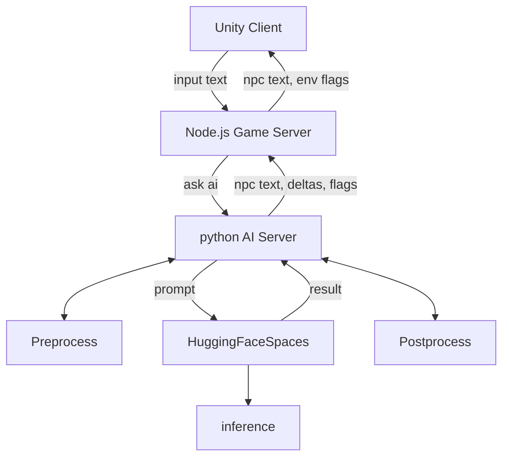

# Persona Chat Engine – AI NPC Dialogue System 🎭

[](https://github.com/m97j/persona-chat-engine)


## 📌 개요
**Persona Chat Engine**은 게임 내 NPC(Non-Player Character)와의 상호작용을 위한 AI 대화 엔진입니다.
게임 플레이어의 선택과 행동, NPC 상태를 반영하여 자연스러운 대화와 퀘스트 진행을 생성하며, **Delta/Flag** 기반 행동 및 감정 변화를 모델링합니다.

* **목표:** 게임 환경에서 몰입감 있는 AI NPC 대화와 퀘스트 반응 생성
* **핵심 기술:** Transformer 기반 LLM, QLoRA 파인튜닝, 멀티헤드 학습(Delta/Flag), 커스텀 프롬프트 포맷

---

## ⚙️ 아키텍처


---

## ⚙️ AI 서버 (ai-server/)

### 역할

* **게임 서버와의 통신:** 플레이어의 발화와 상태 정보를 수신하고, 모델 추론을 위한 입력 데이터를 준비
* **프롬프트 구성:** 게임 서버로부터 받은 데이터를 기반으로 모델에 입력할 프롬프트를 생성
* **전처리:** 프롬프트의 포맷을 모델에 맞게 조정하고, 필요한 추가 정보를 삽입
* **후처리:** 모델의 출력을 게임 서버가 처리할 수 있는 형식으로 변환

### 주요 모듈

* **`dialogue_manager.py`:** 대화 흐름 관리 및 NPC 응답 생성
* **`preprocess.py`:** 입력 데이터의 전처리 및 프롬프트 구성
* **`postprocess.py`:** 모델 출력의 후처리 및 게임 서버와의 데이터 포맷 변환
* **`hf_client.py`:** Hugging Face Spaces와의 통신을 위한 클라이언트 구현

### 데이터 흐름

1. **게임 서버 요청 수신:** 플레이어의 발화와 상태 정보를 포함한 요청을 수신
2. **프롬프트 생성:** `preprocess.py`를 통해 모델에 입력할 프롬프트를 생성
3. **모델 추론:** `hf_client.py`를 사용하여 Hugging Face Spaces에 요청을 보내고 응답을 수신
4. **후처리:** `postprocess.py`를 통해 응답을 게임 서버가 처리할 수 있는 형식으로 변환
5. **게임 서버로 응답 전송:** 변환된 응답을 게임 서버로 전송하여 게임 상태를 업데이트

---

## 🚀 Hugging Face Spaces (hf-serve/)

### 역할

* **모델 호스팅:** Fine-tuned된 모델과 LoRA 어댑터를 호스팅하여 추론 서비스 제공
* **API 엔드포인트:** 게임 서버의 요청을 처리할 수 있는 RESTful API 엔드포인트 제공

### 구성 요소

* **`server.py`:** FastAPI를 기반으로 한 RESTful API 서버 구현
* **`model_utils.py`:** 모델 로딩 및 추론을 위한 유틸리티 함수
* **`requirements.txt`:** 필요한 Python 패키지 목록

### 배포

* **Hugging Face Spaces:** `hf-serve/` 디렉토리의 코드를 Hugging Face Spaces에 배포하여 API 엔드포인트 제공
* **AI 서버 통합:** AI 서버는 해당 API 엔드포인트를 호출하여 NPC의 응답을 수신

---

## 📊 모델 설계 및 학습 (train/)

* Colab Notebook: [Train Model on Colab](https://colab.research.google.com/...)
* Hugging Face Model: [HF Model](https://huggingface.co/my-model)

## 🛠 모델 기능

### 1. NPC 대화 생성

* 플레이어 발화(`player_utterance`)를 기반으로 NPC 응답 생성
* NPC의 감정, 신뢰도, 관계 상태 등을 반영
* 대화 맥락(`context`) 유지

### 2. 행동 및 상태 추적

* **Delta Head:** NPC 신뢰(`trust`)와 관계(`relationship`) 변화 수치 예측
* **Flag Head:** 퀘스트 진행, 아이템 지급, 메인 스토리 종료 여부 등 이벤트 트리거

### 3. 데이터 기반 학습

* JSONL 데이터 구조 기반 학습
**학습 데이터 구조:**

* **형식:** JSONL
* **구성 요소:**

  * `npc_id`: NPC 고유 ID
  * `tags`: 위치, 관계 상태, 신뢰도, 감정 상태 등 태그 정보
  * `context`: 이전 대화 맥락
  * `player_utterance`: 플레이어의 발화
  * `response`: NPC의 응답
  * `delta`: 신뢰도 및 관계도 변화량
  * `flag`: 이벤트 트리거 목록

**예시 데이터:**

```json
{
  "npc_id": "mother_abandoned_factory",
  "tags": {
    "location": "abandoned_factory",
    "quest_stage": "complete",
    "relationship": "close_friend",
    "trust": 0.99,
    "npc_mood": "hopeful",
    "player_reputation": "helpful",
    "style": "somber"
  },
  "context": [
    {"role": "player", "text": "Jason의 삼촌은 어디에 계시죠?"},
    {"role": "npc", "text": "제 동생은 자신의 아지트에 있어요..."}
  ],
  "player_utterance": "네?... 수수께끼 같네요...",
  "response": "정말 고마워요!! 이건 우리 집안의 가보인 금목걸이에요...",
  "delta": [0.00, 0.00],
  "flag": ["give_item", "npc_main_story"]
}
```

### 4. QLoRA 기반 Fine-Tuning

### 1. 모델 아키텍처

**Base Model:** Qwen2.5-3B-Instruct

**Adapter:** LoRA 기반 4bit Quantization Adapter

**멀티헤드 출력 구조:**

* **Delta Head:** NPC의 신뢰도(trust)와 관계도(relationship) 변화를 예측하는 회귀 모델
* **Flag Head:** 퀘스트 진행 상태, 아이템 지급 여부 등 이벤트 트리거를 예측하는 이진 분류 모델

**학습 구성:**

* **Loss 함수:**

  * **LM Loss:** 기존 언어 모델 학습 손실
  * **Delta Loss (MSE):** 신뢰도 및 관계도 예측 오차
  * **Flag Loss (BCE):** 이벤트 트리거 예측 오차

* **Trainer 구현:**

  * `MultiHeadTrainer` 클래스를 통해 멀티헤드 출력을 처리
  * 각 헤드의 출력에 대해 해당하는 손실을 계산하고 합산하여 최종 손실을 도출

```python
class MultiHeadTrainer(Trainer):
    def compute_loss(self, model, inputs, return_outputs=False):
        labels = inputs.pop("labels")
        delta = inputs.pop("delta")
        flag = inputs.pop("flag")
        outputs = model(**inputs, output_hidden_states=True)
        last_hidden = outputs.hidden_states[-1][:, -1, :]
        lm_loss = nn.CrossEntropyLoss(ignore_index=-100)(outputs.logits.view(-1, outputs.logits.size(-1)), labels.view(-1))
        delta_pred = model.delta_head(last_hidden)
        mse_loss = nn.MSELoss()(delta_pred, delta)
        flag_pred = model.flag_head(last_hidden)
        bce_loss = nn.BCEWithLogitsLoss()(flag_pred, flag)
        return lm_loss + mse_loss + bce_loss
```
---

## 📂 디렉토리 구조
```

persona-chat-engine/
│
├── ai-server/        # 대화 파이프라인 관리, 게임 서버와 통신
│   ├── app.py
│   ├── schemas.py
│   ├── agent_manager.py
│   ├── dialogue_manager.py
│   ├── preprocess.py
│   ├── postprocess.py
│   ├── generator.py
│   ├── rag.py
│   ├── config.py
│   ├── utils/
│   │   ├── hf_client.py
│   │   └── model_loader.py
│   └── requirements.txt
│
├── hf-serve/         # Hugging Face 모델 추론 API
│   ├── model_utils.py
│   ├── server.py
│   └── requirements.txt
│
├── train/            # (옵션) 모델 학습 관련 자료
│   ├── README.md     # Colab 학습 링크
│   └── dataset/      # (옵션) json 데이터 샘플
│
└── docker-compose.yml
```

---

## 📦 설치 및 실행

```bash
git clone https://github.com/m97j/persona-chat-engine.git
cd persona-chat-engine
pip install -r requirements.txt
```

### 모델 로드

```python
from transformers import AutoTokenizer, AutoModelForCausalLM
from peft import PeftModel

base_model = "Qwen/Qwen2.5-3B-Instruct"
adapter_path = "lora-output-jason-mom"

tokenizer = AutoTokenizer.from_pretrained(base_model)
model = AutoModelForCausalLM.from_pretrained(base_model)
model = PeftModel.from_pretrained(model, adapter_path)
```

### 샘플 추론

```python
prompt = "<SYS> ... <CTX> ... </CTX> <PLAYER>저기요, Jason을 아시나요?\n<NPC>"
inputs = tokenizer(prompt, return_tensors="pt")
outputs = model.generate(**inputs, max_new_tokens=200)
print(tokenizer.decode(outputs[0], skip_special_tokens=True))
```

---
## 📽 시연 영상

(업데이트 예정)
---

## 🖥 학습 환경

* **GPU:** NVIDIA A100 / Colab GPU
* **Framework:** PyTorch + HuggingFace Transformers
* **Fine-Tuning:** QLoRA (LoRA Adapter)
* **Batch Size:** 16 (Gradient Accumulation 사용)
* **Epochs:** 3
* **Loss 구성:** LM + Delta(MSE) + Flag(BCE)

---

## 🎯 프로젝트 성과

* NPC 신뢰도, 관계 상태, 퀘스트 이벤트 반영 대화 가능
* QLoRA 기반 4bit Adapter 학습으로 효율적 학습 및 배포
* Delta/Flag 헤드로 게임 내 이벤트 및 상태 변화를 동시에 처리
* 포트폴리오용 데모 제공 가능

---

## 📁 포트폴리오 연계

* **FPS Game 프로젝트:** 게임 내 캐릭터 AI와 연동, 이벤트 발생 테스트
* **Persona Chat Engine:** 대화 기반 스토리 전개, 멀티 NPC 관리
* 이 두 프로젝트는 통합적으로 플레이어 경험 설계와 AI NPC 구현 능력을 강조

---

## 🔗 관련 링크

* [Portfolio](https://www.github.com/m97j/portfolio)
* [FPS Game](https://github.com/m97j/fpsgame)
* [Persona Chat Engine](https://github.com/m97j/persona-chat-engine)

---


