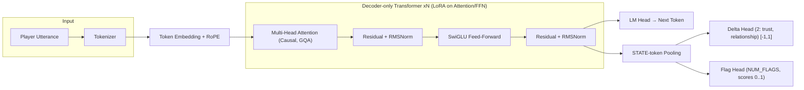
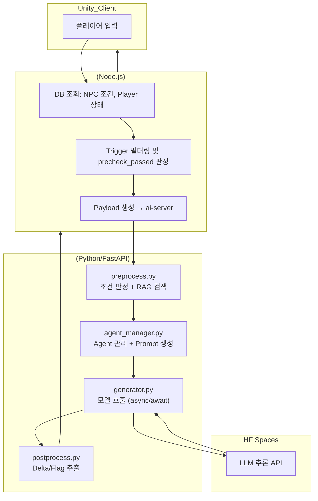
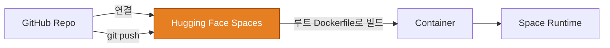

# Persona Chat Engine – AI NPC Dialogue System 🎭

[-Live-blue)](https://huggingface.co/spaces/m97j/PersonaChatEngine_ai_server)
[-Live-blue,)](https://huggingface.co/spaces/m97j/PersonaChatEngine_hf-serve)

## 📑 목차
- [📌 개요](#-개요)
- [🧭 아키텍처 & 프로젝트 구조도](#-아키텍처--프로젝트-구조도)
- [⚙️ AI 서버 (ai-server/)](#%EF%B8%8F-ai-server--요약)
- [🚀 Hugging Face Serve (hf-serve/)](#-hf-serve--hugging-face-spaces-추론-서버)
- [📊 모델 학습 (train/)](#-train--모델-학습)
- [🛳️ 배포 개요 (HF Spaces, Dockerfile 기반)](#%EF%B8%8F-배포-개요-hf-spaces-dockerfile-기반)
- [🎥 시연 & 결과](#-시연--결과)
- [🏁 프로젝트 성과](#-프로젝트-성과)

---

## 📌 개요

**Persona Chat Engine**은 게임 내 NPC 상호작용을 위한 AI 대화 엔진입니다.
플레이어 선택/행동과 NPC 상태를 반영해 자연스러운 대사와 함께 \*\*Delta/Flag(신뢰·관계·이벤트 트리거)\*\*를 예측합니다.

* **핵심 기술**: Transformer 기반 LLM, (Q)LoRA 파인튜닝, 멀티헤드 학습(Delta/Flag), RAG 기반 해석
* **결과물**: 텍스트 응답 + 상태 변화(연속값) + 이벤트 플래그(멀티라벨)

---

## 🧭 아키텍처 & 프로젝트 구조도

* ### 모델 아키텍처

* ### 전체 프로젝트 통신 구조
  ver 1

  ver2

* ### 전체 프로젝트 구조

```mermaid
---
config:
  theme: dark
---
flowchart RL
 subgraph Client["Game Client (Unity)"]
        CLIENT_IN["session_id, npc_id, user_input"]
  end
 subgraph Payload["payload 구조"]
        ssid["session_id"]
        npcid["npc_id"]
        ctx["context"]
        history["dialogue_history"]
  end
 subgraph GameServer["Game Server (Node.js)"]
        BUILD_PAYLOAD["payload 구성"]
        Payload
        APPLY["ai-server결과 적용"]
        UPDATE_DB["상태/DB 업데이트"]
        CLIENT["클라이언트 전송\n(아이템ID, 퀘스트 단계 등)"]
  end
 subgraph app["app.py"]
        ask["/ask endpoint"]
  end
 subgraph PRE["Preprocess"]
        VALIDATE["입력 유효성 체크"]
        FILTER["금지어/조건 필터링"]
  end
 subgraph POST["Postprocess"]
        MAP["flag index→name 매핑"]
        RAG_MATCH["RAG 기반 flag 설명/조건 확인"]
        FORMAT["게임서버 전송 포맷 변환"]
  end
 subgraph dlgmang["dialogue_manager.py"]
        PRE
        POST
        DECISION{"전처리 통과?"}
  end
 subgraph mainprpt["build main prompt"]
        mSYS[": NPC 메타, tags, lore, player_state"]
        mRAG[": 추론시 조건/지시문 (학습시 비움)"]
        mCTX[": 대화 이력"]
        mPLAYER[": 플레이어 발화"]
  end
 subgraph fbprpt["build fallback prompt"]
        fSYS[": NPC 메타, tags, lore, player_state"]
        fRAG[": 추론시 조건/지시문 (학습시 비움)"]
        fPLAYER[": 플레이어 발화"]
  end
 subgraph PROMPTBUILD["prompt_builder.py"]
        mainprpt
        fbprpt
  end
 subgraph FB["Fallback Model (경량)"]
        FB_GEN["간단 응답 생성"]
  end
 subgraph raggen["rag_generator.py"]
        RAG_GEN["retrieve"]
  end
 subgraph AIServer["ai_server (Python)"]
        app
        dlgmang
        PROMPTBUILD
        FB
        raggen
  end
 subgraph DB["MongoAtlas Database"]
        DB_PLAYER["player_status"]
        DB_GAME["game_state"]
        DB_NPC["npc_config"]
        DB_HISTORY["dialogue_history"]
  end
 subgraph HFServe["hf-serve /predict_main"]
        EMB["Token Embedding + RoPE"]
        DEC["Decoder-only Transformer ×N\n(LoRA: q,k,v,o + gate/up/down proj)\n[Attention(Q,K,V)=softmax(QK^T/√d_k)·V]"]
        LM["LM Head → 응답 토큰"]
        POOL["STATE-token Pooling"]
        DELTA["Delta Head [-1,1] (tanh)"]
        FLAG["Flag Head [0..1] (sigmoid)"]
  end
    CLIENT_IN --> BUILD_PAYLOAD
    BUILD_PAYLOAD -- session_id --> DB_PLAYER & DB_GAME & ssid
    BUILD_PAYLOAD -- session_id, npc_id --> DB_NPC
    DB_PLAYER -- player_state --> ctx
    DB_GAME -- game state --> ctx
    DB_GAME -- dialogue history --> history
    DB_NPC -- NPC 메타, lore --> ctx
    BUILD_PAYLOAD -- npc_id --> npcid
    BUILD_PAYLOAD -- player utterance --> ctx
    Payload -- ai_server ask/ 요청 --> ask
    ask --> PRE & APPLY
    PRE --> DECISION
    DECISION -- 예 --> mainprpt
    DECISION -- 아니오 --> fbprpt
    fbprpt --> FB_GEN
    FB_GEN --> POST
    mainprpt -- query --> raggen
    fbprpt -- query --> raggen
    RAG_GEN --> mRAG & fRAG
    mSYS --> EMB
    mRAG --> EMB
    mCTX --> EMB
    mPLAYER --> EMB
    EMB --> DEC
    DEC --> LM & POOL
    POOL --> DELTA & FLAG
    DELTA --> FORMAT
    FLAG --> MAP
    MAP --> RAG_MATCH
    RAG_MATCH -- query --> RAG_GEN
    RAG_GEN -- 조건 description --> RAG_MATCH
    RAG_MATCH --> FORMAT
    LM --> FORMAT
    FORMAT --> ask
    APPLY --> CLIENT & UPDATE_DB
    CLIENT --> Client
     CLIENT_IN:::client
     CLIENT_IN:::client
     ssid:::gameserver
     ssid:::gameserver
     npcid:::gameserver
     npcid:::gameserver
     ctx:::gameserver
     ctx:::gameserver
     history:::gameserver
     history:::gameserver
     BUILD_PAYLOAD:::gameserver
     BUILD_PAYLOAD:::gameserver
     Payload:::gameserver
     APPLY:::gameserver
     APPLY:::gameserver
     UPDATE_DB:::gameserver
     UPDATE_DB:::gameserver
     CLIENT:::gameserver
     CLIENT:::gameserver
     ask:::ais
     ask:::ais
     VALIDATE:::ais
     VALIDATE:::ais
     FILTER:::ais
     FILTER:::ais
     MAP:::ais
     MAP:::ais
     RAG_MATCH:::ais
     RAG_MATCH:::ais
     FORMAT:::ais
     FORMAT:::ais
     DECISION:::ais
     mSYS:::ais
     mSYS:::ais
     mRAG:::ais
     mRAG:::ais
     mCTX:::ais
     mCTX:::ais
     mPLAYER:::ais
     mPLAYER:::ais
     fSYS:::ais
     fSYS:::ais
     fRAG:::ais
     fRAG:::ais
     fPLAYER:::ais
     fPLAYER:::ais
     FB_GEN:::fallback
     FB_GEN:::fallback
     RAG_GEN:::rag
     RAG_GEN:::rag
     DB_PLAYER:::db
     DB_PLAYER:::db
     DB_GAME:::db
     DB_GAME:::db
     DB_NPC:::db
     DB_NPC:::db
     DB_HISTORY:::db
     DB_HISTORY:::db
     EMB:::hf
     EMB:::hf
     DEC:::hf
     DEC:::hf
     LM:::hf
     LM:::hf
     POOL:::hf
     POOL:::hf
     DELTA:::hf
     DELTA:::hf
     FLAG:::hf
     FLAG:::hf
     Client:::client
    classDef client fill:#2ECC71,stroke:#145A32,color:#fff
    classDef gameserver fill:#3498DB,stroke:#1B4F72,color:#fff
    classDef db fill:#E67E22,stroke:#7E5109,color:#fff
    classDef ais fill:#95A5A6,stroke:#424949,color:#fff
    classDef hf fill:#9B59B6,stroke:#512E5F,color:#fff
    classDef fallback fill:#F39C12,stroke:#7E5109,color:#fff
    classDef rag fill:#1ABC9C,stroke:#0E6251,color:#fff
```

---

## 📁 루트 디렉토리별 개요

### ⚙️ `ai-server/` — **요약**

* **역할**: 게임 서버 요청 수신(FastAPI) → 전처리 → HF Spaces 추론 호출 → 후처리(Delta/Flag) → 결과 반환
* **구성**: `app.py`(엔드포인트), `pipeline/`(pre/postprocess, generator), `rag/`(조건·메타 문서), `utils/`(HF 클라이언트)
* **배포**: (자세한 런타임 설명은 **HF Spaces README**로 이동)
  → \*\*레포 루트의 `Dockerfile`\*\*로 Spaces가 **직접 빌드/실행**하며, **Git push 시 자동 재빌드/재시작**됨
* **세부 사항**: 👉 **[HF Spaces 페이지 README에서 보기](https://huggingface.co/spaces/m97j/PersonaChatEngine_ai_server)**

---

### 🚀 `hf-serve/` — **Hugging Face Spaces (추론 서버)**

* **역할**: **Base LLM(Qwen2.5-3B-Instruct)** + **LoRA 어댑터** 로드 후 **REST API** 제공 (`POST /predict_main`)
* **핵심 포인트**

  * `model_utils.py`: 토크나이즈/생성 + LoRA 병합/적용
  * `server.py`: FastAPI/Gradio(옵션) 엔드포인트
  * `requirements.txt`: 추론 서버 경량 의존성
* **세부 사항**: 
  👉 [Live Space](https://huggingface.co/spaces/m97j/PersonaChatEngine) & [상세 문서](https://huggingface.co/spaces/m97j/PersonaChatEngine_hf-serve/blob/main/README.md)
  👉 [모델 카드](https://huggingface.co/m97j/npc_LoRA-fps)

---

### 📊 `train/` — **모델 학습**

* **데이터**: JSONL (`npc_id`, `tags`, `context`, `player_utterance`, `response`, `delta`, `flag`)
* **학습**: **LoRA(QLoRA 4bit)**, **MultiHeadTrainer** (LM Loss + Delta Huber + Flag BCE + Threshold MSE)
* **산출물**: LoRA 어댑터, 추가 헤드(`delta_head.pt`, `flag_head.pt`, `threshold_head.pt`), `flags.json`, `thresholds.json`
* **브랜치 전략**: 자동 **feature/** 증가 + `latest` 덮어쓰기
* **세부 사항**: 👉 [**Colab Notebook**](https://colab.research.google.com/drive/1_-qH8kdoU2Jj58TdaSnswHex-BFefInq?usp=sharing)

---

## 🛳️ 배포 개요 (HF Spaces, Dockerfile 기반)

---

## 🧩 기술 하이라이트

* **멀티헤드 학습**: LM(토큰 예측)과 **Delta/Flag** 분기 동시 최적화 → 게임 상태 반영형 응답
* **STATE-token Pooling**: `<STATE>` 토큰 기반 임베딩 풀링 → 상태 헤드 입력 일관성
* **RAG 해석**: Flag 점수/임계값을 문서 기반 조건과 매칭해 **게임 액션 텍스트**로 변환
* **포스트프로세싱 검증**: threshold 튜닝, macro/micro F1 및 AUROC/AUPRC로 다각도 평가
* **운영**: **Spaces 자가 빌드** 파이프라인으로 운영 복잡도↓, 변경 반영 속도↑

---

## 🎥 시연 & 결과

* 업데이트 예정

---

## 🗺️ 로드맵

* Spaces 멀티 모델/브랜치 롤아웃 (Blue/Green)
* 게임 서버 A/B 테스트 자동화
* LoRA 양자화/온디맨드 로딩 최적화

---

## 📎 참고 링크

* **HF Spaces (라이브 & 상세 문서)**:  
  * [ai_server](https://huggingface.co/spaces/m97j/PersonaChatEngine_ai_server)
  * [hf-serve](https://huggingface.co/spaces/m97j/PersonaChatEngine_hf-serve)
* **Model Card**: 
  * [HF Hub](https://huggingface.co/m97j/npc_LoRA-fps)
* **Model Structure & Training & inference test**: 
  * [colab notebook](https://colab.research.google.com/drive/1_-qH8kdoU2Jj58TdaSnswHex-BFefInq?usp=sharing)

---

## 🏁 프로젝트 성과
- NPC 신뢰도·관계 상태·퀘스트 이벤트 반영 대화 가능
- Delta/Flag Head로 게임 상태 변화 동시 처리
- RAG 기반 컨텍스트 검색으로 상황별 응답 품질 향상
- Oracle Cloud ARM 무료 인스턴스 + Docker Hub + HF Spaces 통합 배포 설계

---

## 📁 프로젝트 연계

* **[FPS Game](https://github.com/m97j/fpsgame)**:
  * Client - 이벤트 테스트 및 게임 루프 연계
  * game_server - ai_server의 ask/ endpoint 형식에 맞는 페이로드 생성, 통신 결과를 실제 게임 데이터(Game_DB)에 적용, Client와의 통신 담당
* **[Persona Chat Engine](https://github.com/m97j/persona-chat-engine)**: 멀티 NPC, 스토리/퀘스트 전개 파이프라인
* 이 두 프로젝트는 통합적으로 플레이어 경험 설계와 AI NPC 구현 능력을 강화함

---

