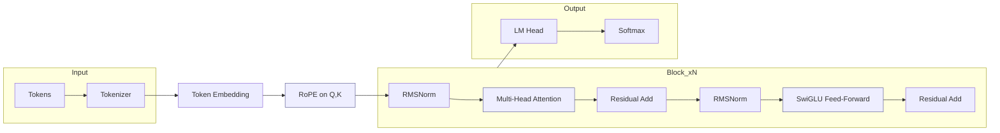
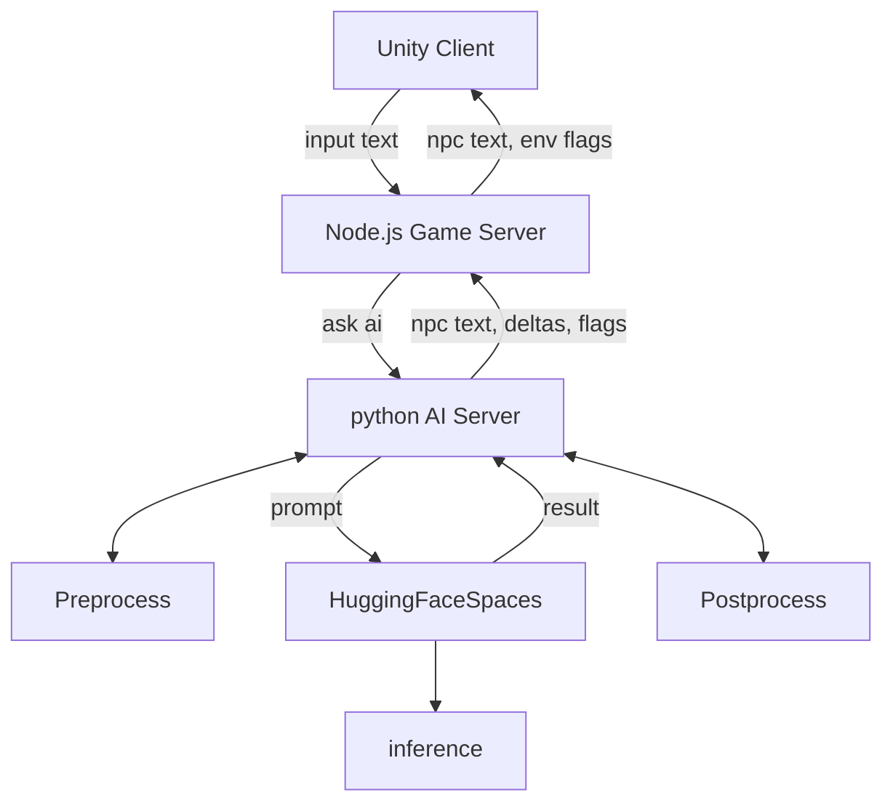
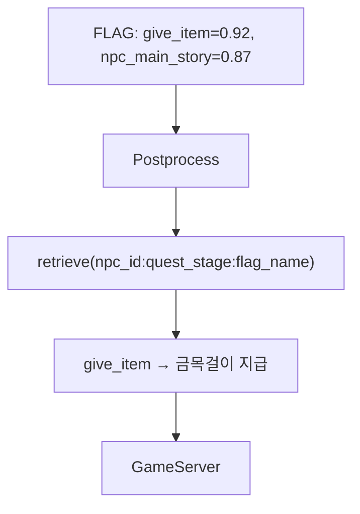

# Persona Chat Engine – AI NPC Dialogue System 🎭

[](https://github.com/m97j/persona-chat-engine)


## 📌 개요
**Persona Chat Engine**은 게임 내 NPC(Non-Player Character)와의 상호작용을 위한 AI 대화 엔진입니다.  
플레이어의 선택/행동, NPC 상태를 반영해 자연스러운 대사와 퀘스트 진행을 생성하며, **Delta/Flag** 기반의 상태 변화(신뢰·관계)와 이벤트 트리거를 함께 예측합니다.

- **목표:** 게임 환경에서 몰입감 있는 AI NPC 대화와 퀘스트 반응 생성
- **핵심 기술:** Transformer 기반 LLM, QLoRA 파인튜닝, 멀티헤드 학습(Delta/Flag), 커스텀 프롬프트 포맷, RAG 기반 flag 해석

---

## ⚙️ 아키텍처

### 모델 아키텍처


### 전체 프로젝트 구성


---

## ⚙️ AI 서버 (ai-server/)

### 역할 & 데이터 흐름

1. **게임 서버 요청 수신(`app.py`)**

   * 최소 입력만 와도 동작: `{ text, npc_id, player_id, ... }`
   * 옵션: 게임 서버가 보낸 상태/컨텍스트가 부족하면 `rag/`에서 NPC 메타(예: `docs/npc_config.json`)를 조회해 보강
2. **전처리/프롬프트 구성(`pipeline/preprocess.py`, `utils/context_parser.py`, `manager/prompt_builder.py`)**

   * 태그/컨텍스트/플레이어 발화를 묶어 **모델 포맷**(`<SYS>`, `<CTX>`, `<PLAYER>`, `<NPC>`)으로 구성
3. **추론 요청(`utils/hf_client.py`, `models/fallback_model.py`, `pipeline/generator.py`)**
   * preprocess.py에서 통과하지 못한 input은 `models/fallback_model.py`에서 fallback text 생성
   * preprocess.py에 통과한 input은 `pipeline/generator.py` 에서 payload구성
   * 페이로드: `prompt`, `npc_id`, `persona_tags`, `gen_params`(temperature, max\_new\_tokens 등)
   * HF Spaces의 `/predict_main` 으로 HTTP POST

4. **후처리(`pipeline/postprocess.py`)**

   * 모델 응답에서 \*\*대사 텍스트, delta(연속값), flag(이벤트)\*\*를 파싱/정규화
   * 예: `flags`는 시그모이드+threshold, `delta`는 범위 클램프·라운딩
5. **게임 서버 응답(`schemas.py`)**

   * 표준화 JSON으로 반환

   ```json
   {
     "text": "NPC의 대답...",
     "delta": {"trust": 0.10, "relationship": 0.08},
     "flags": {"give_item": true, "npc_main_story": false, "quest_stage_change": false},
     "meta": {"npc_id": "mother_abandoned_factory"}
   }
   ```

### 📁 디렉토리 구조

```bash
ai-server/
├── app.py                  # FastAPI 엔트리포인트
├── config.py               # 서버 설정 및 모델 경로 관리
├── schemas.py              # 요청/응답 데이터 구조 정의
├── requirements.txt        # 의존성 패키지 목록

├── pipeline/               # 대화 흐름 처리 모듈
│   ├── __init__.py
│   ├── preprocess.py       # 입력 전처리 및 프롬프트 구성
│   ├── postprocess.py      # 모델 출력 후처리 및 flag/delta 추출
│   └── generator.py        # 모델 추론 요청 처리

├── rag/                    # RAG 기반 flag 해석 모듈
│   ├── __init__.py
│   ├── rag_generator.py    # NPC별 상황에 따른 flag 텍스트 해석
│   └── docs/
│       └── npc_config.json # NPC별 flag 해석 기준 문서

├── utils/                  # 유틸리티 모듈
│   ├── __init__.py
│   ├── hf_client.py        # Hugging Face API 통신 클라이언트
│   └── context_parser.py   # 대화 맥락 파싱 및 구조화

├── models/                 # 모델 로딩 및 fallback 처리
│   └── model_loader.py     # 모델 로딩 유틸리티
```

### 주요 모듈

- **dialogue_manager.py**: 전체 대화 흐름을 제어하며, fallback 처리, 프롬프트 생성, 모델 추론, 후처리까지 담당
- **preprocess.py**: 플레이어 입력과 NPC 상태를 기반으로 전처리
- **postprocess.py**: 모델 출력에서 `<RESPONSE>`, `<FLAG>`, `<DELTA>` 태그를 파싱하고, RAG를 통해 flag를 텍스트로 해석
- **rag_generator.py**: NPC ID, 퀘스트 단계, flag 이름을 기반으로 문서 검색 및 텍스트 반환


### 🧩 RAG 기반 Flag 해석 흐름



- 모델은 수치 기반 flag를 예측
- `postprocess.py`는 RAG를 통해 해당 수치를 텍스트로 해석
- 게임 서버는 이를 기반으로 실제 아이템 지급, 퀘스트 진행 등을 결정

---

## 🚀 Hugging Face Spaces (hf-serve/)

* ### 역할

* **모델 호스팅 + API 엔드포인트**

  * Base LLM(Qwen2.5-3B-Instruct) + **LoRA 어댑터**를 로드해 추론
  * **REST 엔드포인트** 제공: `POST /infer` → `{ text, delta[], flags{} }` JSON 반환
* **Gradio UI(옵션)**

  * 같은 Space에서 간단한 인터랙티브 테스트 UI 제공 (버튼·텍스트박스 기반)

### 구성 요소

* **`server.py`:** FastAPI를 기반으로 한 RESTful API 서버 구현
* **`model_utils.py`:** 베이스 모델 + 어댑터 로딩, 토크나이즈/생성
* **`requirements.txt`:** 필요한 Python 패키지 목록 [`transformers`, `peft`, `accelerate`, `fastapi`/`gradio`, 등]

### 배포

* **[Hugging Face Spaces](https://huggingface.co/spaces/m97j/PersonaChatEngine):** `hf-serve/` 디렉토리의 코드를 Hugging Face Spaces에 배포하여 API 엔드포인트 제공
* **[Hugging Face Hub](https://huggingface.co/m97j/npc_LoRA-fps):** LoRA Fine Tuning 한 adapter files를 배포하여 spaces에서 base model과 함게 로드 가능하도록 제공
* **AI 서버 통합:** AI 서버는 해당 API 엔드포인트를 호출하여 NPC의 응답을 수신

---

## 📊 모델 설계 및 학습 (train/)

* Colab Notebook:  [Train Model on Colab](https://colab.research.google.com/drive/1_-qH8kdoU2Jj58TdaSnswHex-BFefInq?usp=sharing)
* Hugging Face Model: [HF Model](https://huggingface.co/spaces/m97j/PersonaChatEngine)

## 🛠 모델 기능

### 1. NPC 대화 생성

* 플레이어 발화(`player_utterance`)를 기반으로 NPC 응답 생성
* NPC의 감정, 신뢰도, 관계 상태 등을 반영
* 태그(감정/신뢰/관계/퀘스트 단계 등) 반영
* 대화 맥락(`context`) 유지

### 2. 행동 및 상태 추적

* **Delta Head:** NPC 신뢰(`trust`)와 관계(`relationship`) 변화 수치 예측
* **Flag Head:** 퀘스트 진행, 아이템 지급, 메인 스토리 종료 여부 등 이벤트 트리거

### 3. 데이터 기반 학습

* JSONL 데이터 구조 기반 학습
**학습 데이터 구조:**

* **형식:** JSONL
* **구성 요소:**

  * `npc_id`: NPC 고유 ID
  * `tags`: 위치, 관계 상태, 신뢰도, 감정 상태 등 태그 정보
  * `context`: 이전 대화 맥락
  * `player_utterance`: 플레이어의 발화
  * `response`: NPC의 응답
  * `delta`: 신뢰도 및 관계도 변화량
  * `flag`: 이벤트 트리거 목록

**예시 데이터:**

```json
{
  "npc_id": "mother_abandoned_factory",
  "tags": {
    "location": "abandoned_factory",
    "quest_stage": "complete",
    "relationship": "close_friend",
    "trust": 0.99,
    "npc_mood": "hopeful",
    "player_reputation": "helpful",
    "style": "somber"
  },
  "context": [
    {"role": "player", "text": "Jason의 삼촌은 어디에 계시죠?"},
    {"role": "npc", "text": "제 동생은 자신의 아지트에 있어요..."}
  ],
  "player_utterance": "네?... 수수께끼 같네요...",
  "response": "정말 고마워요!! 이건 우리 집안의 가보인 금목걸이에요...",
  "delta": [0.00, 0.00],
  "flag": ["give_item", "npc_main_story"]
}
```

### 4. QLoRA 기반 Fine-Tuning

#### **1) 모델 아키텍처**

**Base Model:** Qwen2.5-3B-Instruct

**Adapter:** LoRA 기반 4bit Quantization Adapter

**멀티헤드 아키텍처:**

* **LM Head**: 대사 텍스트 생성 (언어모델 표준 next-token)
* **Delta Head**: 마지막 토큰 히든에서 `Linear(hidden, 2)` → *(trustΔ, relationshipΔ)*
* **Flag Head**: `Linear(hidden, N_flags)` → 시그모이드 후 임계값으로 이벤트 on/off

> **별도 헤드 추가한 이유:**
> 대사는 **창의적 다양성**이 필요하고, Delta/Flag는 **결정적·정확성**이 중요합니다. 텍스트 내부에 `<DELTA ...>`를 넣어 학습하면 **LM Loss**에 종속되어 노이즈가 커지고 포맷 일탈에 취약합니다. 반면 **별도 회귀/분류 헤드**는 대사와 **독립적인 지도 신호**를 받아 안정적인 예측을 학습합니다.

#### **2) 학습 구성:**

* **Loss 함수:**

* **LM Loss**: `CrossEntropy(ignore_index=-100)`

  * 프롬프트 토큰은 `-100`으로 마스킹(모델이 정답 토큰 위치만 학습)
    
* **Delta Loss (회귀)**: `MSELoss`

  * Δ값은 보통 `[-1, 1]` 범위의 **연속값** → 평균제곱오차가 적합
  * **팁**: 레이블/예측을 `[-1, 1]`로 **클램프**하면 외란(outlier)에 안정
  * (선택) 노이즈가 심하면 `HuberLoss(=SmoothL1)`로 교체 시 **강건성↑**
    
* **Flag Loss (다중 이진)**: `BCEWithLogitsLoss`

  * 다중 이벤트의 **불균형**을 완화하려면 `pos_weight`로 양성 가중치 부여
  * 임계값 기본 `0.5`, 이벤트별로 `0.3~0.7` **튜닝** 가능
    
* **총손실**: `L = L_lm + λΔ·L_mse + λF·L_bce`

  * 기본은 1:1:1, 게임 요구(정확도 강조) 에 따라 `λΔ/λF`를 **상향** 가능


#### **3) 전처리/토크나이즈 설계**

* **포맷**:

  ```
  <SYS> ... TAGS ... FORMAT ... </SYS>
  <CTX> ... 대화 이력 ... </CTX>
  <PLAYER>사용자 발화
  <NPC>
  ```
* **라벨 마스킹**: 프롬프트 부분은 `-100`으로 마스킹 → **정답 텍스트**만 학습
* **Padding/Truncation**: 디코더 LM은 **right padding**이 안전, `MAX_LEN=1024`
* **Delta/Flag는 텍스트 외부**의 별도 텐서로 제공 → 멀티헤드 학습에 직접 투입


#### **4) Trainer 구현:**

* **4bit + QLoRA**: 메모리/속도 효율과 수렴성의 균형
* **`target_modules=["q_proj","k_proj","v_proj","o_proj","gate_proj","up_proj","down_proj"]`**

  * Qwen/Mistral 계열에서 검증된 조합 → **표현력** 확보
* **Optimizer**: `paged_adamw_32bit` (LoRA + 4bit 환경에서 안정적)
* **LR 스케줄러**: `cosine + warmup_ratio=0.03` → 과적합/발산 방지
* **Gradient Checkpointing + Accumulation**: VRAM 절감 + 유효 배치 ↑
* **`output_hidden_states=True`**: 마지막 토큰 히든을 별도 헤드에 공급


### 🖥 학습 환경

* **GPU:** NVIDIA A100 / Colab GPU
* **Framework:** PyTorch + HuggingFace Transformers
* **Fine-Tuning:** QLoRA (LoRA Adapter)
* **Batch Size:** 16 (Gradient Accumulation 사용)
* **Epochs:** 3
* **Loss 구성:** LM + Delta(MSE) + Flag(BCE)

---

## 🎯 프로젝트 성과

- NPC 신뢰도, 관계 상태, 퀘스트 이벤트 반영 대화 가능
- QLoRA 기반 4bit Adapter 학습으로 효율적 학습 및 배포
- Delta/Flag 헤드로 게임 내 이벤트 및 상태 변화를 동시에 처리
- RAG 기반 flag 해석으로 상황별 텍스트 응답 가능

---

## 📁 포트폴리오 연계

* **[FPS Game](https://github.com/m97j/fpsgame)**: 이벤트 테스트 및 게임 루프 연계
* **[Persona Chat Engine](https://github.com/m97j/persona-chat-engine)**: 멀티 NPC, 스토리/퀘스트 전개 파이프라인
* 이 두 프로젝트는 통합적으로 플레이어 경험 설계와 AI NPC 구현 능력을 강조

---

