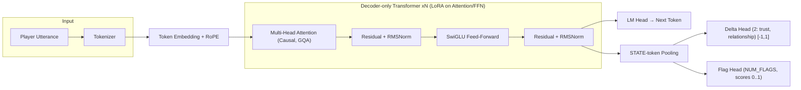
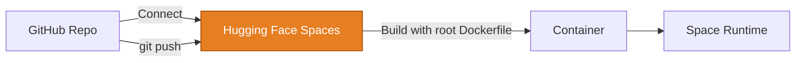

# Persona Chat Engine – AI NPC Dialogue System 🎭

[-Live-blue)](https://huggingface.co/spaces/m97j/PersonaChatEngine_ai_server)
[-Live-blue,)](https://huggingface.co/spaces/m97j/PersonaChatEngine_hf-serve)

## 📑 Table of Contents
- [📌 Overview](#-Overview)
- [🧭 Architecture & Project Structure](#-Architecture--Project-Structure)
- [⚙️ AI Server (ai-server/)](#%EF%B8%8F-ai-server--summary)
- [🚀 Hugging Face Inference Serve (hf-serve/)](#-hf-serve--hugging-face-spaces-inference-server)
- [📊 Model Training (train/)](#-train--model-training)
- [🛳️ Deployment Overview (HF Spaces, Dockerfile-based)](#%EF%B8%8F-Deployment-Overview-hf-spaces-dockerfile-based)
- [🎥 Demo & Results](#-Demo--Results)
- [🏁 Project Achievements](#-Project-Achievements)

---

## 📌 Overview

**Persona Chat Engine** is an AI conversation engine for in-game NPC interactions.
It predicts Delta/Flag (trust, relationship, and event triggers) along with natural dialogue based on player choices/actions and NPC states.

* **Core Technologies**: Transformer-based LLM, (Q)LoRA fine-tuning, multi-head learning (Delta/Flag), RAG-based interpretation
* **Output**: Text response + state transition (continuous value) + event flag (multi-label)

---

## 🧭 Architecture & Project Structure

* ### Model Architecture

* ### Integrated architecture of all projects (Persona Chat Engine + FpsGame)

```mermaid
---
config:
  theme: dark
---
flowchart RL
 subgraph Client["Game Client (Unity)"]
        CLIENT_IN["session_id, npc_id, user_input"]
  end
 subgraph Payload["payload structure"]
        ssid["session_id"]
        npcid["npc_id"]
        ctx["context"]
        history["dialogue_history"]
  end
 subgraph GameServer["Game Server (Node.js)"]
        BUILD_PAYLOAD["payload builder"]
        APPLY["ai-server result verification"]
        UPDATE_DB["Status/DB Update"]
        CLIENT["Client transfer\n(item ID, quest stage, etc.)"]
  end
 subgraph app["app.py"]
        ask["/ask endpoint"]
  end
 subgraph PRE["Preprocess"]
        VALIDATE["Input validation"]
        FILTER["Forbidden words/condition filtering"]
  end
 subgraph POST["Postprocess"]
        MAP["flag index→name mapping"]
        RAG_MATCH["RAG-based flag description/condition check"]
        FORMAT["Game server transmission format conversion"]
  end

 subgraph mainprpt["build main prompt"]
  end
 subgraph fbprpt["build fallback prompt"]
  end
 subgraph FB["Fallback Model -lightweight"]
        FB_GEN["Create a simple response"]
  end
 subgraph raggen["rag_generator.py"]
        RAG_GEN["retrieve"]
  end
 subgraph AIServer["ai_server (Python)"]
        app
        PRE
        POST
        mainprpt
        fbprpt
        FB
        raggen
  end
 subgraph DB["Game DB (MongoAtlas)"]
        DB_PLAYER["player_status"]
        DB_GAME["game_state"]
        DB_NPC["npc_config"]
        DB_HISTORY["dialogue_history"]
  end
 subgraph HFServe["hf-serve /predict_main"]
        EMB["Token Embedding + RoPE"]
        DEC["Decoder-only Transformer × N
        __________``(LoRA:_q,k,v,o_+_gate/up/down_proj)``__________
        [Attention(Q,K,V)=softmax(QK^T/√d_k)·V]"]
        LM["LM Head → Response Token"]
        POOL["STATE-token Pooling"]
        DELTA["Delta Head [-1,1] (tanh)"]
        FLAG["Flag Head [0..1] (sigmoid)"]
  end
    CLIENT_IN --> BUILD_PAYLOAD
    BUILD_PAYLOAD -- search with 
    [session_id, npc_id] --> DB
    DB --
    get context, history data
    [game_state, NPC_state, player_state, dialogue_history] --> BUILD_PAYLOAD
    GameServer -- ai_server ask/ request --> Payload
    Payload -- ai_server ask/ request --> ask
    app --> PRE 
    app --ai_server ask/ response--> APPLY
    PRE -- Preprocessing pass --> mainprpt
    PRE -- Preprocessing failure --> fbprpt
    fbprpt --> FB
    FB --> POST
    mainprpt & fbprpt --query--> raggen
    raggen --rag result data--> mainprpt & fbprpt
    mainprpt -- player utterance,
    npc meta, 
    rag, 
    history --> EMB
    EMB --> DEC
    DEC --> LM & POOL
    POOL --> DELTA & FLAG
    HFServe -- Passing 
    [lm, delta, flag] 
    head values --> POST
    MAP --> RAG_MATCH
    RAG_MATCH <--> raggen
    POST --Pass npc_response, delta, and flag--> app
    APPLY --> CLIENT & UPDATE_DB
    UPDATE_DB -- update --> DB
    CLIENT --> Client
     CLIENT_IN:::client
     ssid:::gameserver
     npcid:::gameserver
     ctx:::gameserver
     history:::gameserver
     BUILD_PAYLOAD:::gameserver
     Payload:::gameserver
     APPLY:::gameserver
     UPDATE_DB:::gameserver
     CLIENT:::gameserver
     ask:::ais
     VALIDATE:::ais
     FILTER:::ais
     MAP:::ais
     RAG_MATCH:::ais
     FORMAT:::ais
     mainprpt:::ais
     fbprpt:::ais
     PRE:::ais
     POST:::ais
     raggen:::ais
     app:::ais
     FB_GEN:::fallback
     FB:::fallback
     RAG_GEN:::rag
     DB_PLAYER:::db
     DB_GAME:::db
     DB_NPC:::db
     DB_HISTORY:::db
     EMB:::hf
     DEC:::hf
     LM:::hf
     POOL:::hf
     DELTA:::hf
     FLAG:::hf
     Client:::client
    classDef client fill:#2ECC71,stroke:#145A32,color:#fff
    classDef gameserver fill:#3498DB,stroke:#1B4F72,color:#fff
    classDef db fill:#E67E22,stroke:#7E5109,color:#fff
    classDef ais fill:#95A5A6,stroke:#424949,color:#fff
    classDef hf fill:#9B59B6,stroke:#512E5F,color:#fff
    classDef fallback fill:#F39C12,stroke:#7E5109,color:#fff
    classDef fallback fill:#F39C12,stroke:#7E5109,color:#fff
    classDef rag fill:#1ABC9C,stroke:#0E6251,color:#fff
```

---

## 📁 Overview by Root Directory

### ⚙️ `ai-server/` — **Summary**

* **Role**: Receive game server request (FastAPI) → Preprocessing → Call HF Spaces inference → Postprocessing (Delta/Flag) → Return result
* **Configuration**: `app.py` (endpoint), `pipeline/` (pre/postprocess, generator), `rag/` (conditions/meta documentation), `utils/` (HF client)
* **Deployment**: (For detailed runtime descriptions, see **HF Spaces README**)
→ \*\*Spaces **builds/runs** directly from the `Dockerfile` in the repo root, and **automatically rebuilds/restarts** upon **Git push**
* **Details**: 👉 **[HF Spaces\[ai_server\]](https://huggingface.co/spaces/m97j/PersonaChatEngine_ai_server)**

---

### 🚀 `hf-serve/` — **Hugging Face Spaces (Inference Server)**

* **Role**: Loads **Base LLM (Qwen2.5-3B-Instruct)** + **LoRA Adapter** and provides **REST API** (`POST /predict_main`)
* **Key Points**

* `model_utils.py`: Tokenize/generate + LoRA merge/adapt
* `server.py`: FastAPI/Gradio (optional) endpoint
* `requirements.txt`: Inference Server lightweight dependency
* **Details**:
👉 [HF Spaces\[hf-serve\]](https://huggingface.co/spaces/m97j/PersonaChatEngine_hf-serve)
👉 [HF Hub\[model card\]](https://huggingface.co/m97j/npc_LoRA-fps)

---

### 📊 `train/` — **Model Training**

* **Data**: JSONL (`npc_id`, `tags`, `context`, `player_utterance`, `response`, `delta`, `flag`)
* **Training**: **LoRA(QLoRA 4bit)**, **MultiHeadTrainer** (LM Loss + Delta Huber + Flag BCE + Threshold MSE)
* **Output**: LoRA adapter, additional heads (`delta_head.pt`, `flag_head.pt`, `threshold_head.pt`), `flags.json`, `thresholds.json`
* **Branch Strategy**: Automatically increment **feature/** + overwrite `latest`
* **Details**: 👉 [**Colab Notebook**](https://colab.research.google.com/drive/1_-qH8kdoU2Jj58TdaSnswHex-BFefInq?usp=sharing)

---

## 🛳️ Deployment Overview (HF Spaces, Dockerfile-based)

---

## 🧩 Technology Highlights

* **Multi-head Learning**: Simultaneously optimize LM (token prediction) and **Delta/Flag** branches → Game-state-informed responses
* **STATE-token Pooling**: Pool embeddings based on `<STATE>` tokens → State head input consistency
* **RAG Interpretation**: Match flag scores/thresholds with document-based conditions to convert them into **game action text**
* **Postprocessing Validation**: Multi-faceted evaluation using threshold tuning, macro/micro F1, and AUROC/AUPRC
* **Operation**: Reduce operational complexity and increase change implementation speed with the **Spaces self-build** pipeline

---

## 🎥 Demo & Results

* To be updated

---

## 🗺️ Roadmap

* Spaces Multi-Model/Branch Rollout (Blue/Green)
* Automated game server A/B testing
* LoRA quantization/on-demand loading optimization

---

## 📎 Reference Links

* **HF Spaces (Live & Detailed Documentation)**:
  * [ai_server](https://huggingface.co/spaces/m97j/PersonaChatEngine_ai_server)
  * [hf-serve](https://huggingface.co/spaces/m97j/PersonaChatEngine_hf-serve)
* **Model Card**:
  * [HF Hub](https://huggingface.co/m97j/npc_LoRA-fps)
* **Model Structure & Training & Inference Test**:
  * [colab notebook](https://colab.research.google.com/drive/1_-qH8kdoU2Jj58TdaSnswHex-BFefInq?usp=sharing)

---

## 🏁 Project Achievements
- NPC trust, relationship status, and quest events reflected in conversations
- Simultaneous processing of game state changes with Delta/Flag Head
- RAG-based context search for improved context-specific response quality
- Docker Hub + HF Spaces integrated deployment design

---

## 📁 Project Links

* **[FPS Game](https://github.com/m97j/fpsgame)**:
  * Client - Event testing and game loop integration
  * game_server - Generates payloads in the ai_server's ask/endpoint format, applies communication results to actual game data (Game_DB), and handles client communication
* **[Persona Chat Engine](https://github.com/m97j/persona-chat-engine)**: Multi-NPC, story/quest development pipeline
  * ​​These two projects integrate to enhance player experience design and AI NPC implementation capabilities.

---
